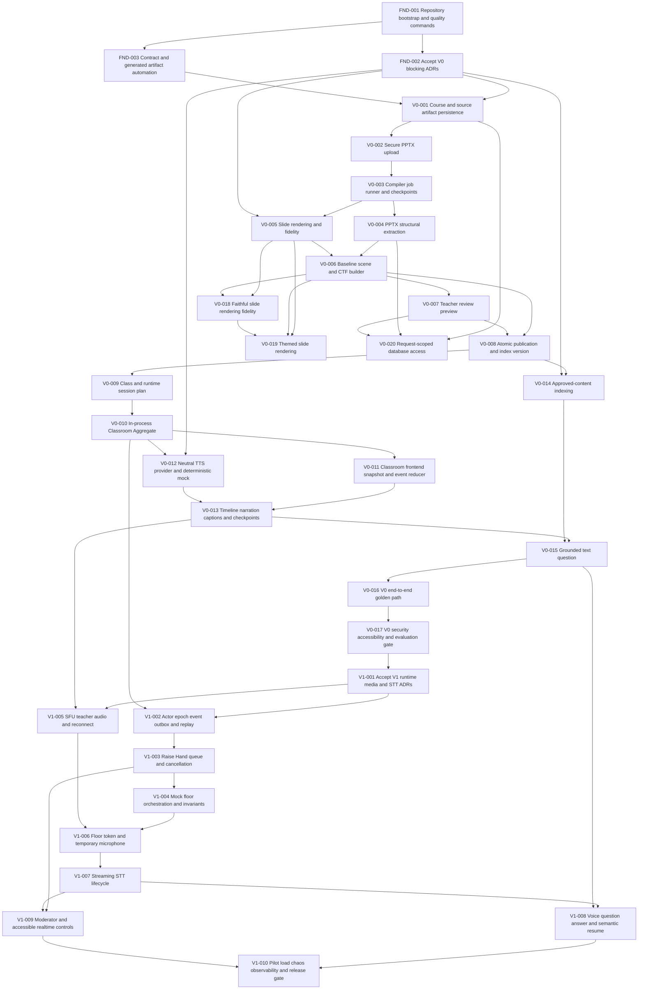

# Dependency Graph

```mermaid
graph TD
  FND_001["FND-001 Repository bootstrap and quality commands"]
  FND_002["FND-002 Accept V0 blocking ADRs"]
  FND_001 --> FND_002
  FND_003["FND-003 Contract and generated artifact automation"]
  FND_001 --> FND_003
  V0_001["V0-001 Course and source artifact persistence"]
  FND_002 --> V0_001
  FND_003 --> V0_001
  V0_002["V0-002 Secure PPTX upload"]
  V0_001 --> V0_002
  V0_003["V0-003 Compiler job runner and checkpoints"]
  V0_002 --> V0_003
  V0_004["V0-004 PPTX structural extraction"]
  V0_003 --> V0_004
  V0_005["V0-005 Slide rendering and fidelity"]
  V0_003 --> V0_005
  FND_002 --> V0_005
  V0_006["V0-006 Baseline scene and CTF builder"]
  V0_004 --> V0_006
  V0_005 --> V0_006
  V0_007["V0-007 Teacher review preview"]
  V0_006 --> V0_007
  V0_008["V0-008 Atomic publication and index version"]
  V0_006 --> V0_008
  V0_007 --> V0_008
  V0_009["V0-009 Class and runtime session plan"]
  V0_008 --> V0_009
  V0_010["V0-010 In-process Classroom Aggregate"]
  V0_009 --> V0_010
  V0_011["V0-011 Classroom frontend snapshot and event reducer"]
  V0_010 --> V0_011
  V0_012["V0-012 Neutral TTS provider and deterministic mock"]
  FND_002 --> V0_012
  V0_010 --> V0_012
  V0_013["V0-013 Timeline narration captions and checkpoints"]
  V0_011 --> V0_013
  V0_012 --> V0_013
  V0_014["V0-014 Approved-content indexing"]
  V0_008 --> V0_014
  FND_002 --> V0_014
  V0_015["V0-015 Grounded text question"]
  V0_013 --> V0_015
  V0_014 --> V0_015
  V0_016["V0-016 V0 end-to-end golden path"]
  V0_015 --> V0_016
  V0_017["V0-017 V0 security accessibility and evaluation gate"]
  V0_016 --> V0_017
  V0_018["V0-018 Faithful slide rendering fidelity"]
  V0_005 --> V0_018
  V0_006 --> V0_018
  V0_019["V0-019 Themed slide rendering"]
  V0_005 --> V0_019
  V0_006 --> V0_019
  V0_018 --> V0_019
  V0_020["V0-020 Request-scoped database access"]
  V0_001 --> V0_020
  V0_004 --> V0_020
  V0_007 --> V0_020
  V1_001["V1-001 Accept V1 runtime media and STT ADRs"]
  V0_017 --> V1_001
  V1_002["V1-002 Actor epoch event outbox and replay"]
  V1_001 --> V1_002
  V0_010 --> V1_002
  V1_003["V1-003 Raise Hand queue and cancellation"]
  V1_002 --> V1_003
  V1_004["V1-004 Mock floor orchestration and invariants"]
  V1_003 --> V1_004
  V1_005["V1-005 SFU teacher audio and reconnect"]
  V1_001 --> V1_005
  V0_013 --> V1_005
  V1_006["V1-006 Floor token and temporary microphone"]
  V1_004 --> V1_006
  V1_005 --> V1_006
  V1_007["V1-007 Streaming STT lifecycle"]
  V1_006 --> V1_007
  V1_008["V1-008 Voice question answer and semantic resume"]
  V1_007 --> V1_008
  V0_015 --> V1_008
  V1_009["V1-009 Moderator and accessible realtime controls"]
  V1_003 --> V1_009
  V1_007 --> V1_009
  V1_010["V1-010 Pilot load chaos observability and release gate"]
  V1_008 --> V1_010
  V1_009 --> V1_010
```
